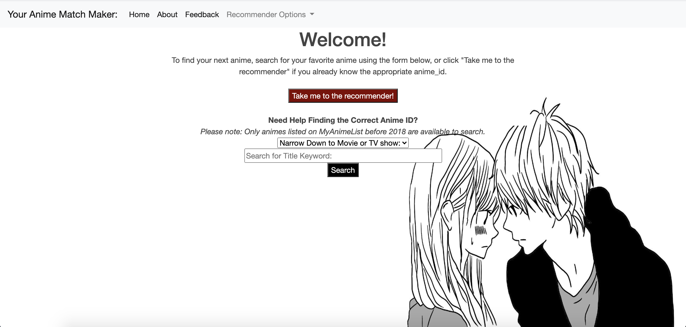

# Welcome to your anime match maker.

## Contents
* [Motivations & Goals](#motivations-and-goals)
* [The Data](#the-data)
  * [Data Cleaning](#data-cleaning)
  * [Exploratory Data Analysis](#eda)
* [Recommenders](#baseline-model)
  * [Popularity](#popularity-based-recommender-system)
  * [Content Based](#content-based-recommender-system)
  * [Simple Collaborative Filtering](#simple-collaborative-filtering)
  * [Model Based Collaborative Filtering](#model-based-collaborative-filtering-with-spark-als)
* [App: Your Anime Match Maker!](#flask-app-your-anime-match-maker)
* [Conclusion, Caveats and Next Steps](#conclusion-caveats-and-next-steps)

## Motivations and Goals
Since shelter-in-place was enacted, more people have been staying home looking for more ways to pass the time. Like many, I found myself wanting to escape to a world of fantasy, and found that anime was the best way to do this.
 However, when I finished one anime, I was surpised how difficult it was to find a similar anime to the one I enjoyed. It required searching on Google and going through various forums to find suggestions that seemed aligned to my tastes.
 **In order to address this problem, my goal will be to create:**
* A content based recommender that will recommend shows/movies similar to my last favorite anime
* An item-item collaborative filter recommender system that will recommend anime based on the ratings of other users who also liked that anime.

**To evaluate my efforts:**
* Spot check a few instances of the recommender with some hand-selected anime from each genre that I am familiar with. Compare the results against MyAnimeList.net recommendations.
* Predict ratings for subset of users (for which ratings data is present), compare the predicted ratings to actual ratings, evaluate using RMSE.

## The Data:
 All data is from Kaggle datasets, scraped from MyAnimeList.net. Last updated 2017 & 2018.
> - **anime_df**: 12,294 animes with name, genre, type, number of episodes, avg_rating, and members
> - **rating_df**: 7M reviews of 11,200 animes from 73,515 users
> - **anime_meta**: 14,478 animes with additional features: English title, dates aired, duration of anime, rating (PG,G,R, etc.), producer, studio, opening & ending theme songs
> - **users_meta**: 302,673 unique users with number of episodes watched, along with gender, birthdate, location, membership_date

## Data Cleaning
* Ratings: Removed all ratings with '-1' which indicates no rating.

**Combining dataframes to get one large dataframe with all metadata for each anime**
* The function for below cleaning is stored in src/data_funcs.py, full_anime_df() function: 
* The anime data and rating data were combined in order to calculated weighted rating based on number of members that rated the anime.
* The anime meta data was joined with the anime dataset through the anime_id in order to display all available meta data for each anime.
* The rating types were streamlined to: G, PG, PG-13, R, R+,Rx, and "Unknown" for any blank values.
* The blanks for genre, studio, and producer were also filled with "Unknown".
* Dropped any duplicate columns contained in both the anime_meta dataset, and the anime dataset. Dropped any irrelevant columns with many nulls, or data that is not useful.

**Exploding the Genre, Producer, & Studio columns to see trends**
* The function for performing this operation is the explode_text() function in src/data.py.

## EDA
**Comparing the average rating to the weighted ratings** The code for this can be found in Notebooks/EDA.ipynb.
* avg_rating from the anime dataset: 6.473902
* weighted_rating average from the anime dataset: 6.654531
* Average ratings from the user rating dataset: 7.8

 -Weighted ratings are more closely centered around the mean, with more right skew, meanwhile average ratings are more normally distributed.
 -The ratings dataset more closely resembles the average ratings, but centered around a higher mean rating. Could be due to rating data missing some ratings of animes listed in the anime dataset.

**Ratings across different features** : 
-Not a big difference between different sources

-Comparing different genres, there are some genres that do much better/worse than majority.

-Comparing the top 20 studios and producers, there are clear studios that are more highly rated by users.
   

## Baseline Model:
**Use the average rating of the training data to predict user ratings of the test data**
* RMSE: 1.57
* Using just the average to predict user ratings already gathers pretty decent results. 

## Popularity Based Recommender System:
* A simple popularity recommender was generated, which returns the top 20 anime based on average rating & number of ratings.
* This will be added to the flask app, along with an option to filter the popular recommendations based on genre of the anime.

## Content Based Recommender System:
**Anime_id Keyword**
* To help users search for the anime_id desired, a helper function called find_id() in src/model_funcs.py was created, which will return all titles that have the keyword.
* The exploration of this process is stored in Notesbooks/Content_Based.ipynb, while the actual recommendation functions are store in model_funcs.py.

**Baseline Content Based Recommender:**
* Features: Type (Movie, TV, etc.), Source (Manga, Music, Book, etc.), and Rating Type (PG, R, etc.).
* Similarity Metrics: Tested Cosine Similarity & Correlation.
* Spot check results: The recommender seems to be recommending popular animes instead of more genre/theme specific.
* RMSE (Cosine Similarity on 100K subset of test): 1.35
* RMSE (Correlation on 100K subset of test): 1.49 
* Final RMSE on test set: 1.346

**Content Based Recommender Iteration 2:**
* Added dummified genre to the content based model, continued with cosine similarity
* Spot check results: overall, the genre significantly helped with the recommendations. The recommender is now recommending more highly rated anime that is closer to the genre specified, though still not perfect
* Final RMSE on test set: 1.305, slight improvement on RMSE, although the recommendations for certain spot checks are much better in my subjective review.

**Content Based Recommender Iteration 3**
* Based on the EDA, some producers/studios have higher ratings overall than others, so I created dummy variables for each of the top 20 studios/producers, but this had no impact on the recommendations.
* Explored clusters of producers & studios, but as there are many duplicates in multiple clusters, did not think this would be worth exploring.
<pre>Clusters of Producers:
 0, Bandai Visual, Pink Pineapple, Lantis, Sanrio, Fuji TV
 1, Unknown, Bandai Visual, Aniplex, NHK, TV Tokyo
 2, TV Tokyo, Tokyo Movie Shinsha, Sanrio, Sotsu, Milky Animation Label
 3, NHK, Sanrio, Tokyo Movie Shinsha, Fuji TV, Milky Animation Label
 4, Aniplex, Tokyo Movie Shinsha, Sanrio, Fuji TV, Milky Animation Label</pre>
<pre>Clusters of Studios:
 0, Sunrise, Madhouse, Production I.G, Studio Pierrot, TMS Entertainment
 1, Unknown, Sunrise, Madhouse, J.C.Staff, Studio Pierrot
 2, Studio Deen, Toei Animation, Sunrise, OLM, Xebec
 3, J.C.Staff, Toei Animation, Sunrise, OLM, Xebec
 4, Toei Animation, Unknown, Nippon Animation, OLM, Tatsunoko Production</pre>

## Simple Collaborative Filtering
**Rating Data Statistics:**
 On average, each user provides 90 ratings, median number of ratings given per user is 45
 On average, each anime has 638 ratings, median number of ratings provided per anime is 57

 For a simple collaborative filter recommenders, I want to recommend the most popular movies from our most active users. I will be removing all users with less than 300 ratings, and all animes with less than 2500 ratings. 
 This leaves us with 4326 users, 694 anime, and 1M reviews.
 The model functions for below KNN/SVD are stored in src/Popular_CollabFilt.py.
### KNN Collaborative Filter
Explored simple KNN & SVD based collaborative filter models, imputing the NaN's with zeros, average per user, and average per anime. The exploration of this process can be viewed in Notebooks/Simple_CF.ipynb.
  **Example from KNN: Fill in NaN's with average anime rating:**
Recommendations for 120 ['Fruits Basket']:
> - 1: ['Ouran Koukou Host Club'], with distance of 0.373
> - 2: ['Vampire Knight'], with distance of 0.462
> - 3: ['07-Ghost'], with distance of 0.480
> - 4: ['Lovely★Complex'], with distance of 0.484
> - 5: ['Special A'], with distance of 0.485
> - 6: ['Vampire Knight Guilty'], with distance of 0.490
> - 7: ['Kamisama Hajimemashita'], with distance of 0.496
> - 8: ['Cardcaptor Sakura'], with distance of 0.498
> - 9: ['Howl No Ugoku Shiro'], with distance of 0.498
> - 10: ['D.N.Angel'], with distance of 0.499
### Simple SVD (imputing the NaNs with average rating per anime) Latent Features:
> - Feature 0: Action fantasy anime with war themes, Military Genre
> - Feature 1: Action and Sci-fi, supernatural
> - Feature 2: Not clear, some comedies, romance, action, video game military
> - Feature 3: Not clear - Action horror sci-fi, A-1 studio
> - Feature 4: Military, Action adventure, Sunrise and Bones studio
> - Feature 5: Naruto, Bleach and Dragonball like movies
> - Feature 6: High school with some random action
> - Feature 7: Slice of life or romance, comedy, school
> - Feature 8: Unclear - mix of everything.
> - Feature 9: Supernatural and psychological</pre>
* **Result:** Upon spot-checking a recommendation, the results did not perform as well as KNN. SVD is having trouble recommending the correct genre and is recommending action animes for every attempt. This is similar to what we saw during latent feature exploration with the action genre in nearly every latent feature.

**Ultimately did not proceed with these simple options due to high computational costs, these models are also biased as they were created only with the most popular anime, and the most active users.**

## Model Based Collaborative Filtering with Spark ALS
* Lastly, I used Spark's ALS model to fit a collaborative filter based recommender that will recommend anime based on the preferences of other users who liked the anime you provided.
* Baseline hyper-parameters: cold-start strategy: drop, 10 latent features, 20 max iterations and 0.1 regularization, this gave me a validation RMSE of 1.13. I then used ALS model's cross validator estimator to tune the model.
* Functions for this recommender are stored in src/als_collab_filt.py, and tuning of the model is stored in Notebooks/ALS_tuning.ipynb. Tuning of the model was done on AWS Sagemaker.

**Results**
* Train RMSE: 1.03
* Validation RMSE: 1.15
* Test RMSE on Cross-Validated (and tuned) model: 1.13

**Final tuned ALS model had 15 latent features**
* Latent features seem to be attempting to separate based on level of maturity and genre, with certain themes (school, sports, music, etc).
> - 0: RX/mature
> - 1: Unclear, mix of random genres, mature
> - 2: Action/Adventure
> - 3: Dementia, fantasy, sci-fi, magic
> - 4: Unclear, random mix of everything
> - 5: Rated G, comedy, kids
> - 6: Romance, Yaoi
> - 7: Supernatural, PG-13 & G, adventure, sci-fi
> - 8: Fantasy, action, PG-13 & G
> - 9: Comedy, romance, drama & school PG-13 & G
> - 10: Super natural, superpower, action, sci-fi PG-13 & G
> - 11: Horror, dementia, mature content with random kids content
> - 12: Sports, action, slice of life, sci-fi
> - 13: Music/drama
> - 14: Mature content with sports theme 

**Spot-Check Results:** 
 Upon spot-checking a few familiar anime, the recommendations from other users consist of some anime that is not so well known. When I searched a description of that anime, it seemed to match very well with the anime searched. I will definitely be testing out some of these recommendations to find my next anime!

## Flask App: Your Anime Match Maker!
 App Demo: [Link To Your Anime Match Maker](https://animerecz.herokuapp.com/) 

* On the Recommeder page, you can view the most popular anime, or filter to the most popular anime for specific genre. Most popular is defined as the most highly rated anime with the highest number of ratings.
* If you already have an anime that you enjoyed in the past, you can locate the anime_id with the search page, or paste the anime_id into the form to get recommendations.
* On the recommendations page (below) you will receive 20 recommendations based on similarity to the specified anime, and 20 recommendations based on other user preferences.

 **Spot-Checking Some Results - Maid Sama:**
 MyAnimeList Recommendations:

 Your Anime Match Maker Recommendations:

* The Content Based Recommender is recommending anime in the top 5 recommendations from MyAnimeList.
* For recommendations from other users, I suspect some hidden gems in this list!

## Conclusion, Caveats and Next Steps
* **There are a lot of anime out there!** When asking anime enthusiasts for feedback, those who recognized most of the recommendations thought the recommendations were good. Those with less anime exposure did not recognize many of the recommendations, and were unable to provide a final evaluation.
* Spot-checking a few instances is not enough to evaluate the entire model, and can be subjective depending on the user. 
* The RMSE is not an exact measure either, since the ultimate success of the project is to provide the most useful recommendations to users.
* The dataset used for this recommender system only has the animes released before 2018, and is missing more recent titles.

**Next Steps**
* Scrape more recent data to get updated recommendations.
* Scrape description of each anime to display with the recommendations. 
* NLP with the descriptions to improve results further.
* Allow to dynamic function to view more results.
* Have the option to see similar animes without similar names. IE: Naruto movies get recommended more Naruto content.
* Find more user metadata to explore clusters of users.
* N-grams for the genre, pairs may be useful.
* Neural Network to see how the recommendations will compare

**Want To Add Feedback?**
* Check out [Your Anime Match Maker](https://animerecz.herokuapp.com/feedback) to give your input on the recommendations!

### Data Sources:
Anime & user metadata from : https://www.kaggle.com/azathoth42/myanimelist
 Anime and rating data from: https://www.kaggle.com/CooperUnion/anime-recommendations-database

