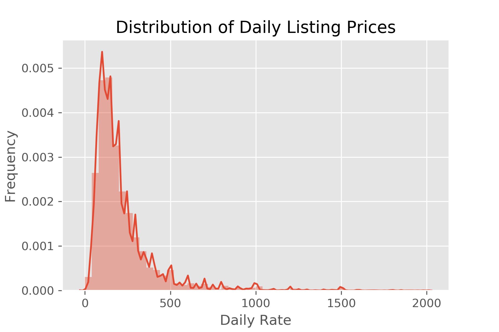
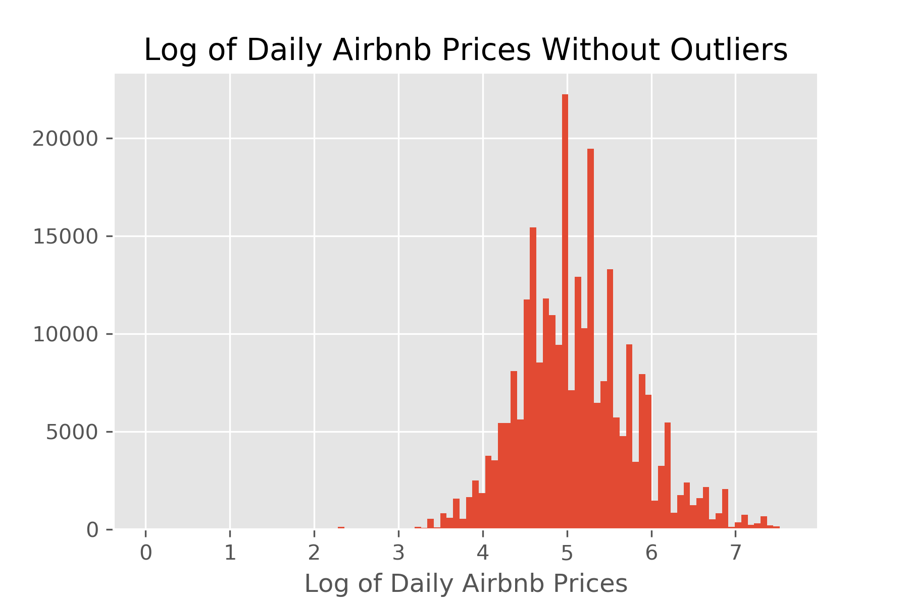
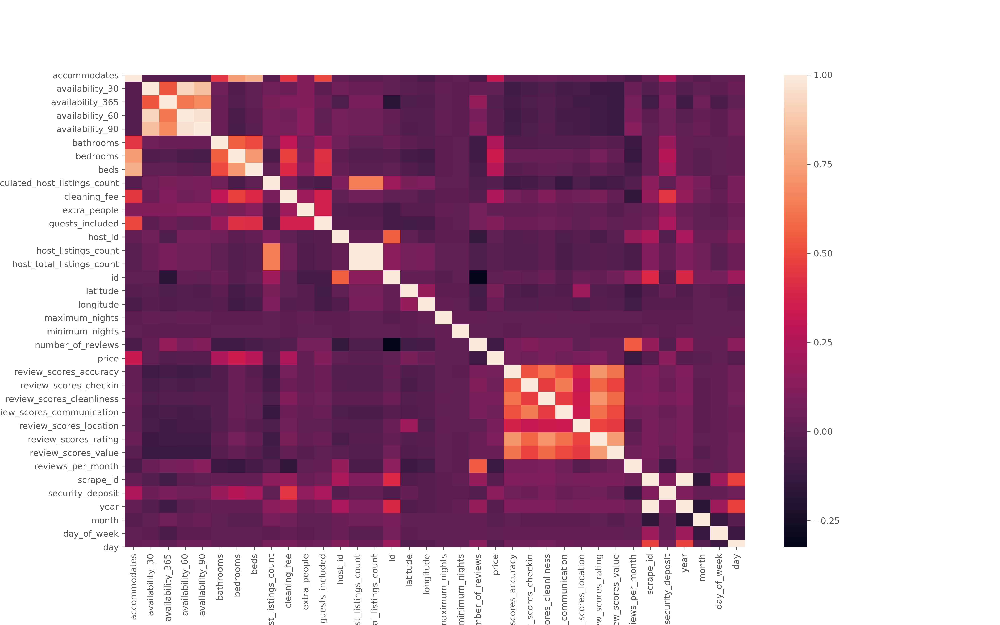
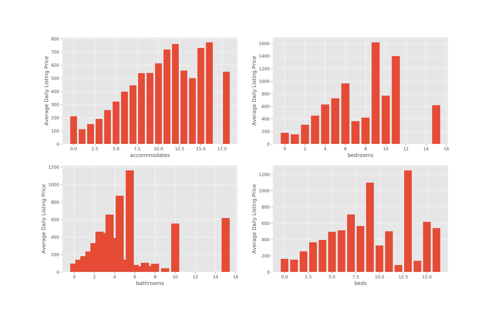
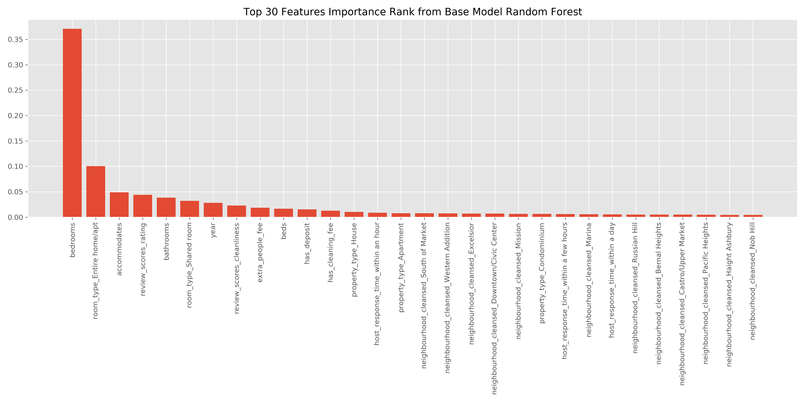
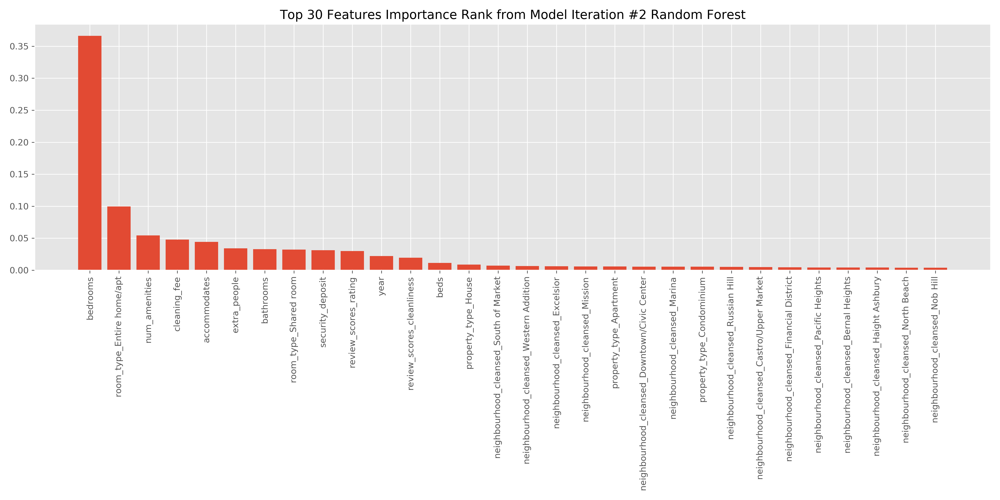
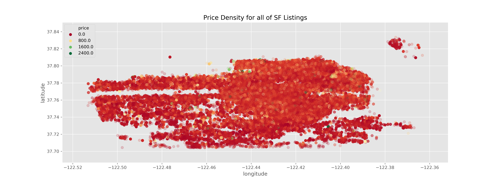
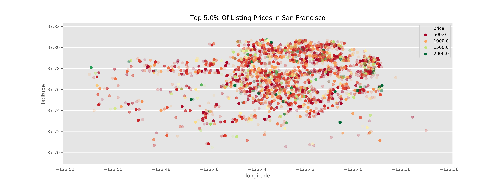
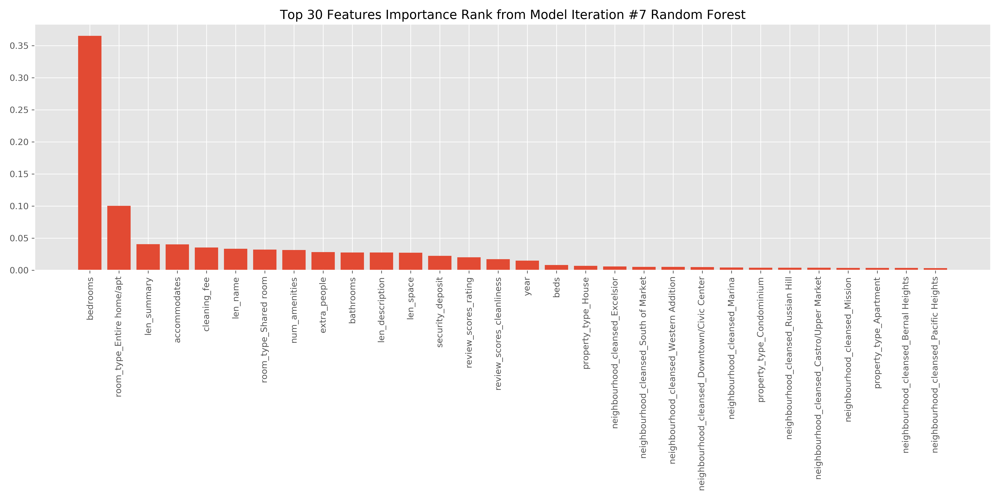
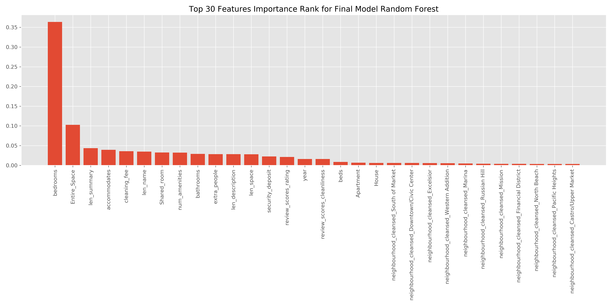

# Predicting Airbnb Daily Listing Prices

## Motivations & Goals
Airbnb has grown widely in the past five years due to increased interest in travel across the world.

Meanwhile, in the Bay Area/San Francisco in particular, the cost of owning a home has continued to increase substantially year over year due to low supply. 

My goal is this project is to predict daily airbnb listing prices, to get a better understanding of the most impactful features for determining listing prices. With this information, I would like to see how it compares to the housing market and value for properties.

## The Datasets

### 52 Datasets Comprised of information for every Airbnb listing available in that month, for 52 months from Sep 2015 to April 2020
<pre>-Data: 395,202 entries, 92 columns
 -Null Values: 2842171 
 Missing Monthly Data: 
 -2015 only had Sep, Nov, and Dec data
 -2016 missing Jan and Mar data
 -2018 missing June data</pre>
 **Data Cleaning**
<pre>-Removed all columns with more that 70% of data being null
 -Converted the "Last Scraped" date to date format, and engineered additional date features to indicate year, month-year, month, dayofweek, and day
 -Converted columns related to currency (price, extra_people, security_deposit and cleaning_fee] from string to float, removed '$'</pre>
## EDA Feature Importances
### Overview of the Data from 2015-2020

 -There is clear seasonality between months. Spike in Airbnb Rentals in 2017 were strongly linked to rent increases in some of the largest US metro areas.

 -Distribution of the daily listings do not follow a normal distribution, so we will take the log and remove the outliers

 -Now that the dependent variable follows a normal distribution, this will likely help with our predictions.
### Numeric Features: 

 -Most important features (based on Correlation plot with correlation over 1%): Accommodates, bathrooms, bedrooms, beds, cleaning_fee, security_deposit, review_scores_rating, review_scores_cleanliness, review_scores_location,   review_scores_accuracy, review_scores_communication, review_scores_checkin, review_scores_value, extra_people, month, year, number_of_reviews

-There is a trend, the more rooms/accomodations available will increase the listing price until a certain threshold, where it appears it no longer matters and does not affect price. Likely due to the fact that places with that much space have difficulties filling.

-Review data also shows a positive trend relating to price.

-For data related to fee, there is a slight positive trend, but with a lot of noise. May be worth it to look into a conversion of this column from numeric to binary classification
### Categorical Features
 -Features that seem to have an impact: neighbourhood_cleansed, property_type, room_type

  Some neighborhoods have clear price differences than others. Sea-side neighborhoods tend to have higher prices (IE: Presidio or Marina)

 -For host related features: I hypothesized that the host response rate, response time, and senority would provide some insight, but for the most part there were not any significant trends.
 -Same for Cancellation Policy and Instant Booking, graphs for which are in the Jupyter notebook for more information.

## Methodology & Baseline Model
 **Methodology:** 
 -Test-Split Option 1: Train Data will be from 2015 - 2018. Test data from 2019-2020.
 -Test-Split Option 2: Randomized Test Size of 30% with all available data
   **Dumb-Model: Just take the average of the train data and predict all future values as the average**
 RMSE: 207.59
 -The average listing price is $234. 
 This RMSE is not good, indicating that using the average listing price is not a good predictor.
   **Baseline Models: No model tuning or feature engineering besides converting price to log. Will only be used for the model selection for tuning.** 
 Features selected for Baseline Model (based on EDA): 'accommodates','bathrooms','bed_type','bedrooms', 'beds','cleaning_fee','extra_people', 'host_response_time', 'neighbourhood_cleansed', 'property_type', 'review_scores_cleanliness', 'review_scores_rating', 'room_type', 'security_deposit', 'year', 'month', 'day_of_week'
 Data Processing: Converted Categorical Data to Dummies.
  **Baseline Models Performance**
 -Between both Test-Split Options, the performance of the models were the same.
 -Linear Regression: Cross-Val R2: 0.61, RMSE: 189.06
 -Decision Tree Regressor: Cross-Val R2: 0.81, RMSE: 96.53
 -Random Forest Regressor: Cross-Val Adj R2: 0.88, RMSE: 81.89
 -Gradient Boosting Regressor: Cross-Val R2: 0.65, RMSE: 152.38
 **Will proceed with Random Forest Estimator for future iterations.**
  **Feature Importance from Baseline Model**

 -Most important feature: Number of Bedrooms
 -Second: Whether or not the Airbnb was access to an entire home/apartment, with the 8th most important feature capturing whether or not the Airbnb was a shared room or not. Seems to highlight that travellers have a preference on privacy.
 -Fees also seem to be important, with all 3 fee categories in the top 20
 -Review ratings overall & cleanliness rating contributed to the price, which makes sense.
 -Year: Interestingly, year made it into the top 20, but not month. This could be due to the fact that 2017 was vastly different from any other year.
 -Property type: Whether or not the property was a house/apartment was also important.
 -Appears that neighborhood may not be as important as suspected, though it appears neighborhoods downtown rank higher overall in the feature rankings.
  
### Additional Feature Engineering
 **Converting The Fee Columns to "0/1" based on whether or not they had the fee**
 -Cross-Validation R2 for Random Forest: Dropped to 0.82
 -Next Step: Keep columns as is
  **Creating a feature that captures the count of amenities provided**
 -Currently the "Amenities" columns is a set of amenities, stored as text. I will count the number of items stored in the set, with each item reflecting an amenity provided by the property.
 -Cross-Validation R2 for Random Forest: Increased to 0.90, RMSE: 71.56
 -The num_amenities feature also became the 3rd most important feature in the feature_importance plot.

 -Next Step: Continue with this feature for future implementation
  **Categorical Feature for Accomodations/beds/bedrooms/bathrooms**
 -Once the number reaches a certain threshold for the accomodation columns, there is an apparent diminishing return.
 -I will create features that determine whether or not the listing is over this threshold.
 -Cross-Validation R2 for Random Forest: No change, 0.90
 -Next Step: Not much of an improvement to keep the feature. Remove to reduce model complexity.
  **Neighborhoods**
 After converting the price density into a heatmap on top of San Francisco, it is apparent that the highest listing prices are concentrated in the center of San Francisco.

 From this insight, I created a new feature to capture whether or not the listing was in the city center, which I determined as 1 if neighborhood within list: ("Western Addition", "South Of Market", "Downtown/Civic Center", "Financial District"), and 0 if not.
 -Cross-Validation R2 for Random Forest: Dropped to 0.87
 -Next Step: Do not proceed with this feature
   **Second Option: Splitting into 4 geographical locations (Northeast, Southeast, Northwest, Southwest), with Northeast holding the top 5% listings in terms of price.**
 <pre>Northeast: Mission, Western Addition, South Of Market, Castro/Upper Market, Downtown/Civic Center, Haight Ashbury, Nob Hill, Marina, Pacific Heights, Russian Hill, North Beach, Financial District, Chinatown, Presidio Heights, 
 Southeast: Bernal Heights, Noe Valley, Potrero Hill, Excelsior, Bayview, Glen Park, Visitacion Valley, Crocker Amazon, Diamond Heights
 Northwest: Inner Richmond, Outer Sunset, Outer Richmond, Inner Sunset, Twin Peaks, Seacliff, Golden Gate Park, Presidio
 Southwest: Outer Mission, Parkside, West of Twin Peaks, Ocean View, Lakeshore
 Other: Treasure Island/YBI</pre>
 -Cross-Validation R2 for Random Forest: Dropped to 0.89
 -Next Step: Do not proceed with this feature
  **Length of Listing Name, Summary, Description, and Space**
 Created features to identity the length (in characters) of the listing name, space, summary, and description. From the below plot, it appears there could be a positive relationship between the length of the listing name, and the listing price.

 -Added this feature into the current best performing model
 -Cross-Validation R2 for Random Forest: Increased to 0.93, RMSE: 61.29
 -Length of summary & name became 2 of the top 10 features

 -Next Step: Continue with this new feature
  **Natural Language Processing**
 Vectorizing & Clustering "Summary", top clusters:
<pre> 0, san, francisco, home, located, city, apartment, heart, neighborhood, great, bedroom
 1, place, good, adventurers, solo, couples, travelers, business, love, ll, close
 2, room, living, kitchen, private, bathroom, bedroom, shared, large, dining, house
 3, home, sf, apartment, city, bedroom, modern, views, great, kitchen, space
 4, union, square, hill, wharf, nob, fisherman, north, chinatown, walking, beach
 5, gate, golden, park, beach, blocks, bridge, ocean, restaurants, haight, located
 6, bed, queen, size, private, bedroom, room, bathroom, sofa, king, tv
 7, mission, restaurants, bart, street, walk, located, away, park, sf, blocks</pre>
 From this, I vectorized the text in "Summary" to 100 features of words, and fit my Random Forest to this data.
 -Cross-Validation R2 for Random Forest: Dropped to 0.86
 -None of the words appeared in the top feature importances.
 -Next Step: Do not proceed with these features

## Model Tuning

 Across all feature engineering attemps, there is some slight overfitting.
 **Eliminate all room_type features except Entire House/Apartment& Shared room.**
 -Cross-Validation R2 for Random Forest: No change, 0.93, RMSE: 61.83
 -Next Step: Proceed with this modification
  **Eliminate all property types except House or Apartment**
 -Cross-Validation R2 for Random Forest: No change, 0.93, RMSE: 61.83
 -Next Step: Did not reduce performance too much, but was able to remove a lot of features.
 -Feature engineer one feature that captures whether or not the property is an apartment/house
  **Grid Search to Optimize Model Performance**
 -Performed GridSearch on Random Forest to obtain optimal parameters: max_features (20) & n_estimators(400)
 -Cross-Validation R2 for Random Forest: 0.94, RMSE: 59.33
 -Next Step: Test the model on the final test data

## Results & Conclusion: 
 Total Final Features: 73 (22 Main Features + Dummies)

 The test set performed the same as the cross-validation performance.
 R2 on Unseen Test Data: 0.94
 Adjusted R2: 0.93
 RMSE on Unseen Test Data: 56.68
 Based on this model, the most important features for determining price of listing in San Francisco are: number of bedrooms, whether or not the listing is private space or shared, the length of the summary & name of listing, the number of people accomodated, and if there are extra fees associated.

## Assumptions Made & Caveats....
 -Data Source: InsideAirbnb.com. 
 -Listing Prices are set by the host and may not reflect the final price paid by the tenant. Thus, it would make sense that hosts that spend more time writing summaries and noting amenities would aim for a higher listing price. It cannot be confirmed whether or not the attempts were successful and tenants actually paid this much.

## Goals for future Analysis:
<by>-Compare the listing prices to actual value of the property according to Zillow.
 -Look into specific amenities and if they are more important 
 -Inferential Model with Linear Regression
 -Dive Deeper into Neural Network and deep learning model

